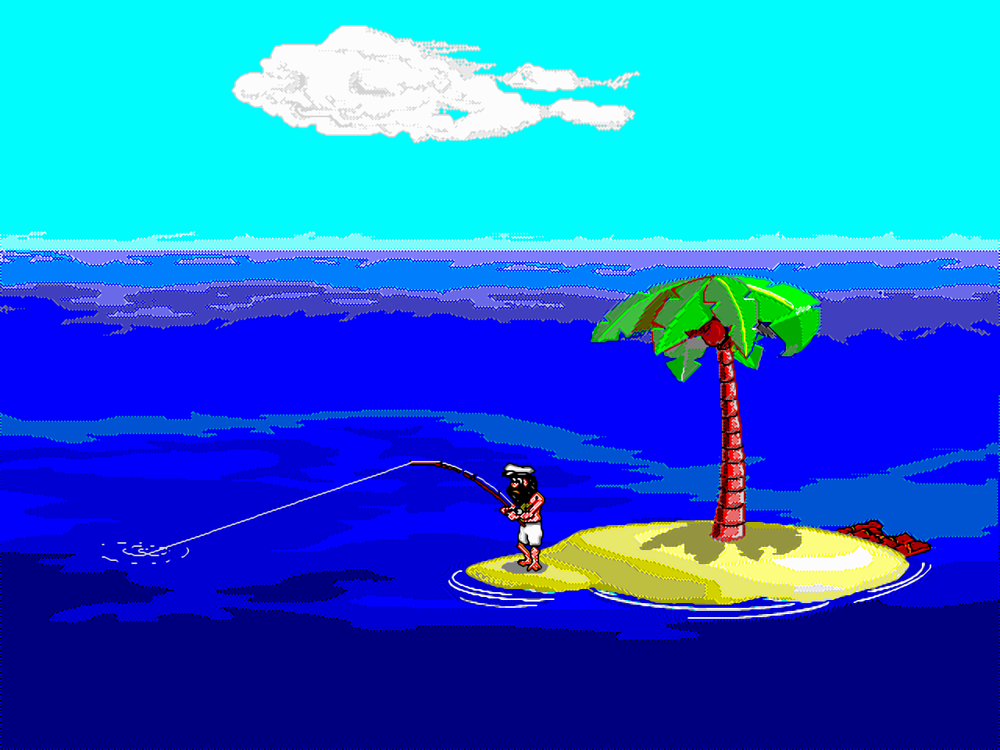

<!-- SPDX-License-Identifier: GPL-3.0-or-later -->
# Wilson Reborn

Um clone **moderno, portável e melhorado** do clássico screensaver **Johnny Castaway**
(Sierra/Dynamix, 1992) — "o primeiro protetor de tela que conta uma história".

O objetivo é trazer de volta o Johnny com **paridade total** (todos os gags, eventos,
sequências narrativas, easter eggs, datas comemorativas e comportamentos do original),
rodando em **Windows, Linux e macOS** com **resoluções modernas** e melhorias opcionais, sem
perder nada do original.

> 🌎 In English: **[README.md](README.md)**

## Demo

▶ **Experimente ao vivo no navegador (traga seus dados):** <https://antigerme.github.io/wilson-reborn/>




*Renders ao vivo da engine do Wilson Reborn, a partir dos dados originais de 1992.* O
screensaver original também está preservado no
[Internet Archive](https://archive.org/details/johnny-castaway-screensaver).

> A arte é **copyright** da Sierra/Dynamix, mostrada aqui só para ilustrar o projeto. Este
> repositório **não** inclui dados do jogo — compile e rode com a sua própria cópia (abaixo).

## Como rodar

O Wilson Reborn usa **os arquivos originais** do Johnny Castaway (`RESOURCE.MAP` +
`RESOURCE.001`) — não há arte embutida. Ele procura os dados em: `--data <dir>` →
`$WILSON_DATA_DIR` → diretório atual → ao lado do executável (e numa subpasta `data/` de
cada um). Sem os dados, lista onde procurou e sai.

```bash
cargo run -p wilson -- --data <dir>              # seus RESOURCE.MAP/RESOURCE.001 originais
cargo run -p wilson -- --data <dir> --windowed   # em janela 640×480 (dev)
```

Roda em **tela cheia** por padrão (comportamento de screensaver); qualquer tecla/clique
encerra. Requer Rust estável. O `--data` também aceita o `.zip` do Internet Archive direto
(o zip de run ou o instalador); veja [docs/INSTALL.md](docs/INSTALL.md).

### Opções

Passe por linha de comando (vencem o arquivo, só nesta execução) ou edite o arquivo de
configuração (criado no 1º uso; veja o caminho com `wilson /c`):

| Opção | Valores | Efeito |
|---|---|---|
| `--windowed` | — | roda em janela em vez de tela cheia (`windowed=true`) |
| `--mute` | — | desliga os efeitos sonoros (`mute=true`) |
| `--speed <pct>` | `25`–`400` | velocidade da animação, % do original (`speed=100`) |
| `--scale <modo>` | `fit`\|`stretch`\|`integer`\|`extend` | como a imagem preenche a janela; `extend` preenche widescreen (`scale=fit`) |
| `--filter <modo>` | `nearest`\|`linear`\|`xbr`\|`xbrz` | filtro de upscaling (`filter=linear`) |
| `--dedither` | — | suaviza o dither do mar/céu (padrão off = visual autêntico) (`dedither=false`) |
| `--daynight <modo>` | `original`\|`real24h` | ciclo dia/noite: 8 h como em 1992, ou 24 h pelo relógio (`daynight=original`) |

**Verbos de screensaver do Windows:** `/s` (mostrar), `/p <hwnd>` (preview embutido na
miniatura da janela de configuração — só no Windows), `/c` (configuração — imprime as
opções, o caminho do arquivo e as **estatísticas**: sessões, tempo total e maior dia
alcançado).

## Base de Conhecimento

Toda a engenharia reversa, o catálogo de conteúdo e o plano de implementação estão
documentados em **[`docs/knowledge-base/`](docs/knowledge-base/README.md)**:

- [01 — História e Créditos](docs/knowledge-base/01-historia-e-creditos.md)
- [02 — Bíblia de Conteúdo](docs/knowledge-base/02-biblia-de-conteudo.md) *(todos os recursos do original)*
- [03 — Dados Originais e Formatos](docs/knowledge-base/03-dados-originais-e-formatos.md)
- [04 — Motor de Scripting: Opcodes TTM/ADS](docs/knowledge-base/04-engine-scripting-opcodes.md)
- [05 — Arquitetura do Engine](docs/knowledge-base/05-arquitetura-do-engine.md)
- [06 — Projetos de Referência](docs/knowledge-base/06-projetos-de-referencia.md)
- [07 — Plano do Port Moderno](docs/knowledge-base/07-plano-do-port-moderno.md)

Veja também **[docs/ARCHITECTURE.md](docs/ARCHITECTURE.md)** para o pipeline dados→pixels e
como validar. *(O `ARCHITECTURE.md` está em inglês; a tradução da knowledge-base está em
andamento.)*

## Referências externas

O Wilson Reborn foi construído estudando cinco reimplementações open-source independentes do
motor original (detalhes em [knowledge base 06](docs/knowledge-base/06-projetos-de-referencia.md)).
Elas **não** são vendorizadas neste repositório — clone os upstreams para comparar:

- [jc_reborn](https://github.com/jno6809/jc_reborn) (C/SDL2) — o blueprint principal de gameplay
- [ScummVM `dgds`](https://github.com/scummvm/scummvm) (C++) — a autoridade do formato DGDS (`engines/dgds`)
- [Johnny-Castaway-Open-Source / JCOS](https://github.com/nivs1978/Johnny-Castaway-Open-Source) (C#) — dicionário de opcodes
- [castaway](https://github.com/xesf/castaway) & [dgds-viewer](https://github.com/xesf/dgds-viewer) (JavaScript) — metadados e tooling

## Instalação / empacotamento

Binários prontos (Windows `wilson.scr` e Linux) são publicados a cada tag de versão pelo
workflow de release. Veja **[docs/INSTALL.md](docs/INSTALL.md)** para instalar o screensaver
no Windows, rodar no Linux/macOS e publicar releases.

> **Build autossuficiente (uso pessoal):** quem já tem o jogo original pode embutir os dados
> no binário com `WILSON_EMBED_DATA=<dir> cargo build --release -p wilson --features
> embed-data` — gera um único arquivo que roda sem `--data`. Os dados são copyright e **não**
> são redistribuídos; por isso esse build não é publicado nas releases.

> **Rodar no navegador (WASM):** 🌐 **demo ao vivo: <https://antigerme.github.io/wilson-reborn/>**
> (traga seus dados — nada é enviado). A engine também compila para WebAssembly — veja
> **[`crates/wilson-web`](crates/wilson-web/README.md)**. Gere com
> `crates/wilson-web/build-web.sh` (ou `scripts/build-embedded.sh --web`). Arraste seus próprios
> `RESOURCE.MAP`/`RESOURCE.001` (ou um `scrantic-run.zip` / `scrantic-installer.zip`) — lidos
> localmente, nada é enviado — e, se quiser, **salve** no navegador pra não reescolher depois.
> Som ligado por padrão (🔊 + volume), botão de **⛶ tela cheia** (mantém a tela acordada) e
> opções na URL espelhando o desktop (`?fullscreen&scale=fit&filter=linear&speed=200&day=5&`
> `dissolve&story&daynight=real&intro=0`). Nenhum dado é embutido (diferente do `embed-data`).

## Status

✅ **Engine completo em Rust + janela ao vivo** (o Johnny já roda na tela). Crates:

- `wilson-dgds` — formatos DGDS: `RESOURCE.MAP/.001`, RLE/LZW, `.BMP/.SCR/.TTM/.ADS`, disassembler.
- `wilson-engine` — runtime: interpretadores TTM/ADS, diretor (63 cenas, ciclo de 11 dias,
  feriados/maré/noite), pathfinding, walk e render da ilha; integração `Show`.
- `wilson` — app de janela (winit + softbuffer) que carrega os **arquivos originais**
  (`--data` ou auto-detecção); som, config/opções, persistência do dia e estatísticas.
- `wilson-saver` — a mesma engine exposta via FFI para o screensaver nativo do macOS.
- `wilson-web` — a engine compilada para WebAssembly, roda no navegador (traga seus dados).

Progresso e decisões em
[`docs/knowledge-base/08-decisoes-e-status.md`](docs/knowledge-base/08-decisoes-e-status.md).
O foco é **paridade total com os dados originais** (sem arte recriada).

## Contribuindo

Veja **[CONTRIBUTING.md](CONTRIBUTING.md)**. Em resumo: toda mudança compila e passa
`cargo fmt` / `clippy -D warnings` / os testes do workspace; todo fix de bug vem com teste de
regressão; nunca commitar dados do jogo.

## Licença

**GPL-3.0-or-later** — veja [LICENSE](LICENSE). Os dados originais do jogo são **copyright
Sierra/Dynamix** e nunca entram neste repositório.
